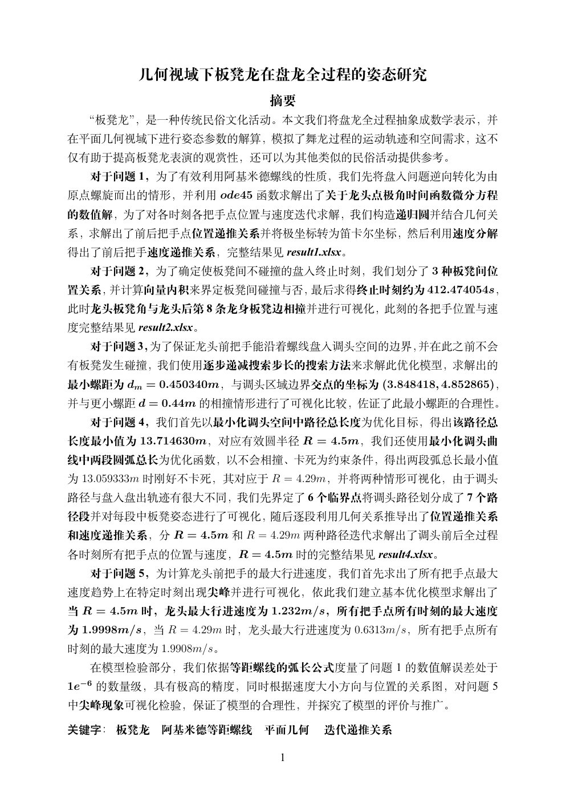
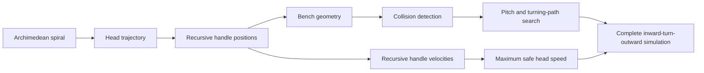
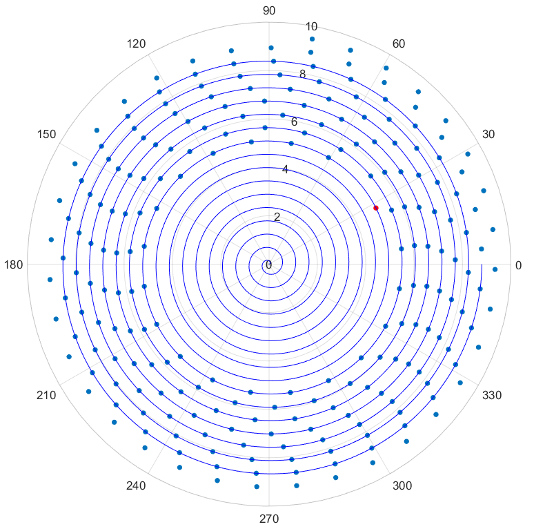
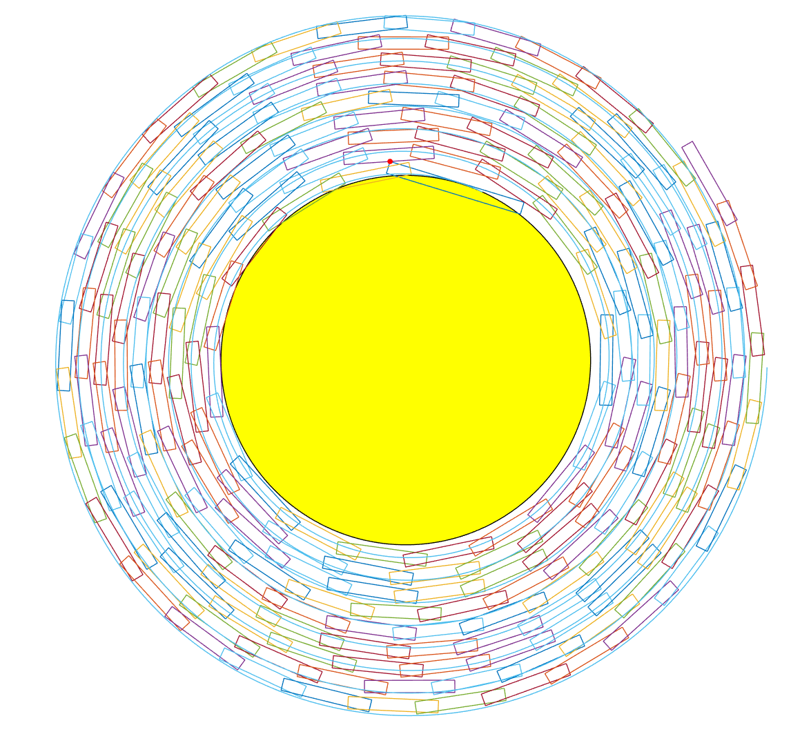
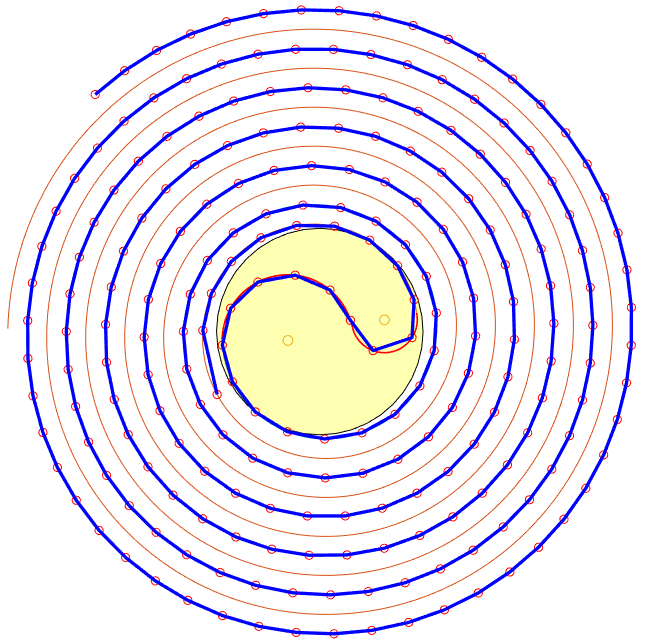

# Bench Dragon Motion Modeling · 2024 CUMCM Problem A

**National Second Prize (Top 2%) in the 2024 China Undergraduate Mathematical Contest in Modeling — a geometry-first MATLAB study of the kinematics, collision constraints, path planning, and speed optimization of a 223-bench dragon.**

[](#award)
[](#award)
[](code/)
[](paper/paper.pdf)
[](problem/problem-a-zh.pdf)
[](paper/paper.pdf)

This repository contains the complete award-winning paper, MATLAB implementation, numerical outputs, and visualizations produced for Problem A of the 2024 China Undergraduate Mathematical Contest in Modeling (CUMCM). The project turns a traditional Chinese bench-dragon performance into a computational geometry and constrained-motion problem.

## Award

> **2024 CUMCM National Second Prize · Top 2% nationwide**
>
> 中国大学生数学建模竞赛国家级二等奖（全国前 2%）

The project was recognized with a **National Second Prize** in the 2024 China Undergraduate Mathematical Contest in Modeling, placing it in the **top 2% of participating teams**.

## Paper

<table>
  <tr>
    <td width="34%" align="center">
      <a href="paper/paper.pdf">
        
      </a>
    </td>
    <td width="66%" valign="top">
      <h3>几何视域下板凳龙在盘龙全过程的姿态研究</h3>
      <p><em>A Geometric Study of Bench-Dragon Posture Throughout the Coiling Process</em></p>
      <p><strong>2024 CUMCM National Second Prize · Top 2%</strong></p>
      <p>The 58-page paper derives the position and velocity recurrences, formulates geometric collision tests, searches for the minimum feasible spiral pitch, optimizes an S-shaped turning path, and estimates the maximum safe head speed.</p>
      <p><strong><a href="paper/paper.pdf">Read the complete paper (PDF) →</a></strong></p>
      <p><a href="problem/problem-a-zh.pdf">Original Problem A statement</a> · <a href="results/">Numerical result workbooks</a></p>
    </td>
  </tr>
</table>

## What this project demonstrates

- **Mathematical modeling:** translated a real multi-body motion problem into Archimedean-spiral geometry and recursive constraints.
- **Computational geometry:** represented 223 rigid benches through 224 handle points and tested rectangle-level collision conditions.
- **Numerical methods:** used ODE solving, root finding, iterative search, and time-stepped simulation across five related tasks.
- **Optimization:** minimized feasible spiral pitch and turning-path length under collision and kinematic constraints.
- **Scientific communication:** connected derivations, algorithms, visual validation, and spreadsheet outputs in a complete technical paper.

The implementation includes **41 MATLAB source files**, three contest-format result workbooks, MATLAB figure sources, and publication-ready visualizations.

## Modeling pipeline



The five contest tasks build on one another:

| Task | Engineering problem | Main technique |
| --- | --- | --- |
| 1 | Recover every handle's position and velocity over 300 s | ODE solution and geometric recurrence |
| 2 | Find the last collision-free inward-spiral instant | Rectangle collision detection and fine time search |
| 3 | Find the minimum pitch that reaches the 9 m turning area | Constrained parameter search |
| 4 | Shorten the two-arc S-turn and simulate the full maneuver | Tangency geometry, root finding, piecewise trajectory modeling |
| 5 | Maximize head speed while keeping every handle below 2 m/s | Velocity propagation and constrained search |

## Quantitative results

| Metric | Reported result |
| --- | ---: |
| Last inward-spiral time before collision | **412.474054 s** |
| Minimum feasible spiral pitch | **0.450340 m** |
| Shortest path with effective radius 4.50 m | **13.714630 m** |
| Shortest two-arc path before locking | **13.059333 m** at radius **4.29 m** |
| Maximum head speed for the 4.50 m solution | **1.232 m/s** |
| Maximum head speed for the 4.29 m solution | **0.6313 m/s** |
| Numerical error reported for the Problem 1 solution | order of **10⁻⁶** |

These values are results reported in the paper and preserved output files; they were not independently re-run during repository packaging.

## Results preview

<table>
  <tr>
    <td align="center"></td>
    <td align="center"></td>
  </tr>
  <tr>
    <td align="center"><strong>Recursive handle placement</strong></td>
    <td align="center"><strong>Minimum-pitch feasibility analysis</strong></td>
  </tr>
  <tr>
    <td colspan="2" align="center"></td>
  </tr>
  <tr>
    <td colspan="2" align="center"><strong>Optimized inward-turn-outward trajectory</strong></td>
  </tr>
</table>

## Technical approach

### Position and velocity propagation

The dragon head follows an Archimedean spiral. Each subsequent handle is located by intersecting the path with a circle whose radius equals the rigid distance to the previous handle. Velocity is then propagated through the bench direction and local path tangents.

### Collision detection

Each bench is modeled as an oriented rectangle. The search filters distant bench pairs and evaluates likely contact points against neighboring bench boundaries, enabling a fine-grained estimate of the first collision time.

### Turning-path optimization

The turning maneuver joins the inward and outward spirals using two tangent circular arcs with a 2:1 radius ratio. The code evaluates path length and locking constraints, then models the motion as seven piecewise trajectory segments.

## Repository guide

```text
code/
  problem1/              Spiral motion and handle position/velocity recurrence
  problem2/              Collision detection and stopping-time search
  problem3/              Minimum feasible pitch search
  problem4/              S-turn geometry and full-path simulation
  problem5/              Maximum safe head-speed search
results/
  result1.xlsx           Problem 1 position and velocity output
  result2.xlsx           Problem 2 collision-limit output
  result4.xlsx           Problem 4 turning-path output
paper/
  paper.pdf              Complete 58-page Chinese paper
problem/
  problem-a-zh.pdf       Original Chinese problem statement
figures/                 Rendered results and editable MATLAB .fig files
```

## Running the code

### Requirements

- MATLAB with standard numerical and plotting functions
- Optimization Toolbox recommended for `fzero`

Each problem is self-contained because several helper functions have problem-specific implementations. Run an entry script from its own directory:

```matlab
cd code/problem1
problem1
```

Replace `problem1` with `problem2`, `problem3`, `problem4`, or `problem5`. Some scripts use very small search steps and can take substantial time. The original output workbooks are available in [`results/`](results/) for inspection without re-running the full search.

## Scope and reproducibility

This repository preserves the original contest implementation and reorganizes it as a readable research artifact. The code has not been refactored into a general-purpose library, packaged with automated tests, or revalidated on the current machine. The README distinguishes paper-reported results from independently reproduced results accordingly.

No open-source license has been granted. The paper, code, data, and figures remain under their respective authors' and source owners' copyrights.
